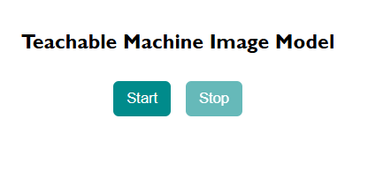
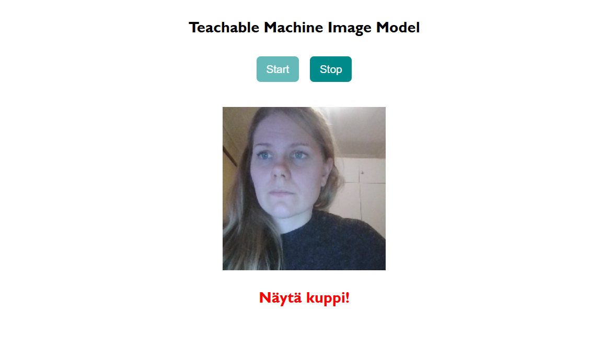
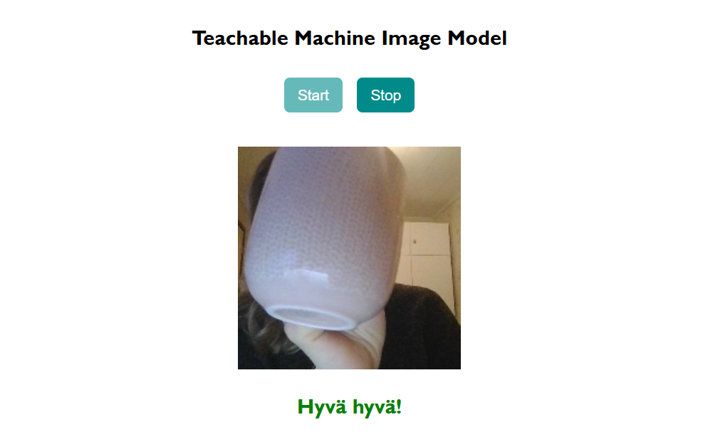

# Moduuli 3, osa 1/2

Tässä osiossa **moduulin 1** jälkimmäisen osion tehtävänä toteutettu staattinen HTML-sivu on otettu käyttöön pilvessä GitHub Pages -palvelu hyödyntäen.

Linkki julkaistulle sivulle: https://inkaliinalauranto.github.io/Deployed-HTML-Page/

## Mooduli 1, osa 2/2

Tässä osiossa on luotu Teachable Machinen avulla yksinkertainen koneoppimismalli kuvasarjojen perusteella. Kuvasarjoja on henkilöstä, kupista ja taustasta. Teachable Machine generoi mallista HTML-tiedoston, jonka sisältöä muokkasin tehtävänantoon sopivaksi. Tuotettu malli ja siihen liittyvä koodi toimivat live-serverillä selaimessa. Ruudulla on otsikko ja kaksi nappia. 

Kun start-napista painaa, tulee ruudulle kamerakuvaa käyttäjän web-kameran kautta. Jos kuvassa näkyy henkilö tai taustaa, kuvan alla on teksti, jossa kehotetaan näyttämään kahvikuppia. Muussa tapauksessa teksti indikoi onnistuneesta kuvauskohteesta

Alkutilanne:\

Web-kamera start-napin avulla päällekytkettynä:\

Kun kuvaan tuodaan kahvikuppi, kamerakuvan alla oleva teksti muuttuu:\
